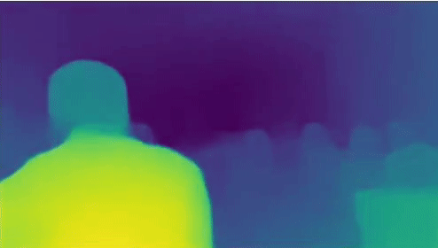

# Monocular Depth Estimation with **MiDaS**
 

Depth estimation is a crucial step towards inferring scene geometry from 2D images. The goal in monocular depth estimation is to predict the depth value of each pixel or inferring depth information, given only a single RGB video as input.
## Introduction
Providing a Depth estimation on Video files via the Famous MiDaS Neural Network.

## How to run
1. Setup the right environment :


```
$ git clone https://github.com/aman190202/MiDAS.git
$ cd MiDAS
$ virtualenv env
$ source env/bin/activate
$ pip install -r requirements.txt
```
2. Run the file
```
$ python main.py
```
The desired file will be saved as **output.mp4**
